# uShell — Micro Shell Framework

**uShell** is a highly configurable, modular micro-shell engine written in C++. It provides a complete command-line framework with typed argument parsing, history, autocomplete, and edit mode, and is designed so that all user logic lives in isolated plugins — entirely separate from the core engine.

The shell runs on both **Linux** and **Windows** (MSVC, MinGW) and is suitable for embedded-style consoles, developer tooling, and any application that needs a scriptable interactive interface.

[What Makes This Shell Different from Others, 7 reasons ..](#what-makes-this-shell-different-from-others)

---

## Generic Overview



---

## What Makes This Shell Different from Others

### 1. No need for special wrapper functions

This shell supports **direct parameters for regular functions**, which means the user **does not need to**:

* create special wrapper functions to be used with the shell (e.g., functions with variable arguments)
* manually extract arguments
* convert arguments to numbers, strings, or other types
* validate the number, type, or range of parameters

All of these tasks are **handled automatically by the shell core**, implemented once and reused across **countless functions**.

---

### 2. Support for Complex Argument Patterns with `Built-in Validation`

Any combination of argument patterns is supported with **built-in validation**, including:

* number of parameters
* parameter types
* accepted value ranges for each parameter

---

### 3. Registering a New Function in the Shell is Easy

If the **parameter pattern already exists**:

* simply add the function name to the configuration file; just copy one line and adapt the function name.

If the **parameter pattern is new**:

1. Describe the function signature (parameters) using a simple **DSL (Domain Specific Language)** — **1 line**
   *(see description below for more details)*

2. Extend the dispatcher for the new argument pattern — **1 line**
   *(copy an existing line and adapt it to the new parameters)*

3. Add the function to the new pattern — **1 line**

**Summary**

* **1 new line** if the parameter pattern already exists
* **3 new lines** if the pattern is new

---

### 4. Support for Shortcuts: `anonymous commands`

Shortcuts are **anonymous commands** that can remain hidden and undocumented, allowing only the person who implemented them to use them.

A shortcut usually consists of a **special character sequence**, e.g. `.`, `-`, `+`, `$`, etc., followed by arguments.
Only the **first character** must be a special character; the following ones can be normal characters such as letters or numbers.

For example:

```
..hello world
```

This command consists of the special sequence `..` (the shortcut) followed by the list of arguments `hello world`.

At runtime, the internal callback registered for the shortcut `..` is executed with `hello world` as its argument.

In this case, however, the callback itself is responsible for handling the parameters, since it receives the entire argument list **as a single string**.

This can also be useful for implementing **debugger-like applications**, where commands are mapped to short sequences of special characters.

---

### 5. Ability to Group Different Functionalities into Plugins

If certain functionalities are unrelated, they can be separated into different plugins.
Plugins can be **loaded or unloaded at runtime**, eliminating the need to build everything into a single large executable.

Additionally, when deploying to different customers, only the **necessary plugins** need to be delivered.
This approach enables a **unified build process**, with the separation occurring only during the **packaging phase**.

---

### 6. Layered Edit Mode

For maximum flexibility, the edit mode is organized into **two layers**:

* By default, the shell starts in **basic edit mode**, where the user can:

  * insert characters
  * use `Backspace` to delete characters backwards
  * use `DEL` to delete the entire line

* Pressing `INS` or `TAB` toggles the shell into **advanced edit mode**, which allows the user to:

  * move to the beginning or end of the line using `Home` and `End`
  * navigate left or right using `Arrow Left` and `Arrow Right`
  * delete the character under the cursor with `DEL`
  * insert characters at the cursor position
  * delete to the beginning of the line with `Ctrl-U`
  * delete to the end of the line with `Ctrl-K`

While in **basic edit mode**, the `Arrow Left` and `Arrow Right` keys can be used to navigate through the list of commands:

* the **entire command list** if nothing has been entered yet
* the **subset of commands** starting with the already typed prefix

Regardless of the edit mode, `Arrow Up` and `Arrow Down` can always be used to **navigate through the command history**.

Additionally, the input is automatically **blocked when the number of entered characters reaches the maximum size configured for the input buffer**.
This prevents buffer overflows caused by user input in a **safe and explicit way**, allowing the user to clearly see when the limit has been reached.

---

### 7. Build-Time Feature Configuration

Almost every feature can be **configured, enabled, or disabled at compile time**, allowing users to build **only the relevant features**, such as autocomplete, history, edit mode, supported data types, input length, and more.

This also makes it possible to control the **memory footprint of the shell component**, when this is relevant.

---

## Table of Contents

1. [Architecture Overview](#1-architecture-overview)
2. [Repository Layout](#2-repository-layout)
3. [Feature Set](#3-feature-set)
4. [Command Syntax](#4-command-syntax)
5. [Built-in Shortcuts](#5-built-in-shortcuts)
6. [Smart Prompt](#6-smart-prompt)
7. [Building the Project](#7-building-the-project)
8. [Configuration Reference](#8-configuration-reference)
9. [Supported Data Types](#9-supported-data-types)
10. [Adding a New Command to an Existing Plugin](#10-adding-a-new-command-to-an-existing-plugin)
11. [Adding a New Parameter Type Pattern](#11-adding-a-new-parameter-type-pattern)
12. [Adding a New User Shortcut](#12-adding-a-new-user-shortcut)
13. [Creating a New Plugin (Shared Library)](#13-creating-a-new-plugin-shared-library)
14. [Plugin Loading at Runtime](#14-plugin-loading-at-runtime)
15. [The `Execute()` Programmatic Interface](#15-the-execute-programmatic-interface)
16. [Extending the Type System](#16-extending-the-type-system)
17. [Multi-Instance Mode](#17-multi-instance-mode)
18. [Script Mode](#18-script-mode)
19. [Logger Utility](#19-logger-utility)
20. [Error Codes](#20-error-codes)
21. [Platform Notes](#21-platform-notes)

---

## 1. Architecture Overview

```
┌─────────────────────────────────────────────────────────────────┐
│                          Application                            │
│  main.cpp  ──►  Microshell::getShellSharedPtr()  ──►  Run()     │
└──────────────────────────┬──────────────────────────────────────┘
                           │
          ┌────────────────▼────────────────┐
          │          uShell Core            │
          │  ushell_core.cpp / ushell_core.h│
          │  - Input loop                   │
          │  - Key handler (ESC sequences)  │
          │  - Command tokenizer + parser   │
          │  - History / Autocomplete /     │
          │    Edit-mode engines            │
          └────────────────┬────────────────┘
                           │  uShellInst_s*
          ┌────────────────▼────────────────┐
          │       User / Plugin Layer       │
          │  *_interface.cpp  (generated)   │
          │  - g_vsFuncDefArray[]           │
          │  - g_vsFuncDefExArray[]         │
          │  - g_vsShortcutsArray[]         │
          │  - uShellExecuteCommand()       │
          │  *_usercode.cpp  (hand-written) │
          │  - actual command functions     │
          └─────────────────────────────────┘
```

The core and the user layer communicate through a single `uShellInst_s` structure. The core never calls user code directly — it calls the function pointer `pfExec` stored in that structure, which dispatches to the correct user function via a `switch` on the parsed parameter type.

---

## 2. Repository Layout

```
sources/
├── CMakeLists.txt                          ← top-level CMake
│
├── ushell_settings/
│   └── inc/
│       └── ushell_core_settings.h          ← THE master config file
│
├── ushell_core/
│   ├── ushell_core/
│   │   ├── inc/ushell_core.h               ← Microshell class declaration
│   │   └── src/ushell_core.cpp             ← full engine implementation
│   ├── ushell_core_config/
│   │   └── inc/
│   │       ├── ushell_core_datatypes.h     ← command_s, uShellInst_s, etc.
│   │       ├── ushell_core_datatypes.cfg   ← X-macro type table (v,b,w,i,l,f,s,o)
│   │       ├── ushell_core_datatypes_user.h← fctDefEx_s, fctype_u function-ptr union
│   │       ├── ushell_core_keys.h          ← key-code definitions
│   │       ├── ushell_core_printout.h      ← uSHELL_PRINTF macro
│   │       └── ushell_core_prompt.cfg      ← prompt symbol configuration
│   ├── ushell_core_terminal/               ← platform terminal (raw mode, TerminalRAII)
│   └── ushell_core_utils/                  ← hexlify / unhexlify helpers
│
└── ushell_user/
    ├── ushell_user_app/
    │   └── src/main.cpp                    ← entry point
    ├── ushell_user_root/                   ← "root" plugin (statically linked)
    │   ├── inc/
    │   │   ├── ushell_root_commands.cfg    ← command declarations
    │   │   ├── ushell_root_datatypes.h     ← sets uSHELL_COMMANDS_CONFIG_FILE
    │   │   └── ushell_root_shortcuts.cfg   ← shortcut declarations
    │   └── src/
    │       ├── ushell_root_interface.cpp   ← boilerplate: tables + dispatcher
    │       └── ushell_root_usercode.cpp    ← user functions (list, pload, vtest…)
    └── ushell_user_plugins/
        ├── CMakeLists.txt
        ├── create_plugin.sh                ← scaffold a new plugin
        ├── template_plugin/                ← copy-paste base for new plugins
        │   ├── CMakeLists.txt              ← builds as a SHARED library
        │   ├── inc/
        │   │   ├── ushell_plugin_commands.cfg
        │   │   ├── ushell_plugin_datatypes.h
        │   │   └── ushell_plugin_shortcuts.cfg
        │   └── src/
        │       ├── ushell_plugin_interface.cpp   ← boilerplate (identical pattern to root)
        │       └── ushell_plugin_usercode.cpp    ← user functions
        └── test_plugin/                    ← example populated plugin
```

---

## 3. Feature Set

| Feature | Description |
|---|---|
| **Typed argument parsing** | Commands declare a parameter pattern (`v`, `i`, `lio`, …). The core validates count, type, and numeric range before calling user code. |
| **History** | Circular buffer (configurable size). Navigate with ↑/↓. Persist to `.hist_<name>` files. |
| **Autocomplete** | Tab/←/→ cycles through matching commands. Reloads on each keypress. |
| **Edit mode** | Full in-line cursor movement, insert, delete, Ctrl+U / Ctrl+K. Activated per-line with TAB or INSERT. |
| **Smart prompt** | Prompt suffix encodes active features: `H` (history), `A` (autocomplete), `E` (edit mode). |
| **Shortcuts** | Single-char `#x` shortcuts. Core set built-in; user-defined shortcuts per plugin. |
| **Color output** | ANSI color codes for prompt, info, warnings, errors. Fully removable at compile-time. |
| **Multi-instance / Plugins** | Root shell can load `.so`/`.dll` plugins at runtime, spawning a nested shell per plugin. |
| **Script mode** | Disables interactive features for scripted/pipe input. |
| **Platform** | Linux (GCC), Windows (MSVC, MinGW). |

---

## 4. Command Syntax

```
COMMAND arg1 arg2 ... argN
```

- Arguments are space-separated tokens.
- **Strings without spaces** do not need quotes: `stest hello`
- **Strings with spaces** require the configured delimiter (default `"`): `stest "hello world"`
- **Numeric arguments** are validated against their declared type range at parse time. E.g. if the pattern declares `num8_t` and you pass `300`, the shell rejects it before calling your function.
- The input buffer maximum length is set by `uSHELL_MAX_INPUT_BUF_LEN` (default 128). When full, the shell displays `]` and ignores further input.

---

## 5. Built-in Shortcuts

Shortcuts are triggered by the `#` prefix character.

| Shortcut | Action |
|---|---|
| `##` | List all commands |
| `##s` | List commands whose name contains substring `s` |
| `##i` | Show full help for the command at index `i` |
| `###` | Full listing: commands + shortcuts + active types |
| `#q` | Quit the shell |
| `#E` / `#e` | Echo on / off |
| `#A` / `#a` | Autocomplete on / off |
| `#H` / `#h` | History on / off |
| `#l` | List history entries |
| `#r` | Reset history |
| `#s{X}` | Set string delimiter to character `X` |
| `#k` | Key decoder — prints key codes (useful for terminal debugging) |

User-defined shortcuts follow the same `#X` syntax and are declared per plugin (see §12).

---

## 6. Smart Prompt

When `uSHELL_IMPLEMENTS_SMART_PROMPT` is enabled the prompt suffix reflects the current state:

```
root[HAE]>       ← history ON, autocomplete ON, edit-mode ON
root[Ha ]>       ← history ON, autocomplete OFF, edit-mode ON
```

Prompt symbols are configurable in `ushell_core_prompt.cfg`.

---

## 7. Building the Project

### Prerequisites

| Toolchain | Notes |
|---|---|
| GCC / Clang (Linux) | CMake 3.5+, standard C++17 |
| MinGW (cross-compile on Linux) | `sudo apt-get install mingw-w64` |
| MSVC (Windows) | Open project folder in Visual Studio; CMake auto-detects |

### Linux native build

```bash
cd sources
mkdir build && cd build
cmake ..
make -j$(nproc)
```

Or use the convenience script at the project root:

```bash
./linux_build.sh
```

### Windows cross-compile (MinGW on Linux)

```bash
./windows_build.sh
```

### Windows native (MSVC)

Open the `sources/` folder in Visual Studio 2019+. CMake integration is detected automatically. Select **Build → Build All**.

### Output artefacts

| Artefact | Path (Linux) | Description |
|---|---|---|
| `ushell` | `build/ushell_user/ushell_user_app/ushell` | Main executable |
| `lib<name>_plugin.so` | `build/ushell_user/ushell_user_plugins/<name>_plugin/` | Dynamically loaded plugin |

At runtime the shell looks for plugins in the `plugins/` directory relative to the working directory. Copy or symlink your `.so`/`.dll` files there before calling `pload`.

---

## 8. Configuration Reference

All compile-time settings live in one file:

```
sources/ushell_settings/inc/ushell_core_settings.h
```

### Feature toggles

| Macro | Default | Description |
|---|---|---|
| `uSHELL_SUPPORTS_MULTIPLE_INSTANCES` | `1` | Enable plugin/nested-shell support |
| `uSHELL_SUPPORTS_EXTERNAL_USER_DATA` | `0` | Pass a `void*` user-data pointer into plugin entry |
| `uSHELL_SUPPORTS_COMMAND_AS_PARAMETER` | `1` | Enable `Execute("cmd")` API |
| `uSHELL_IMPLEMENTS_HISTORY` | `1` | Command history |
| `uSHELL_IMPLEMENTS_SAVE_HISTORY` | `1` | Persist history to file |
| `uSHELL_IMPLEMENTS_AUTOCOMPLETE` | `1` | Tab-complete |
| `uSHELL_IMPLEMENTS_EDITMODE` | `1` | In-line cursor editing |
| `uSHELL_IMPLEMENTS_SMART_PROMPT` | `1` | Dynamic prompt suffix |
| `uSHELL_IMPLEMENTS_COMMAND_HELP` | `1` | `##` / `##i` help system |
| `uSHELL_IMPLEMENTS_USER_SHORTCUTS` | `1` | User-defined shortcuts |
| `uSHELL_SUPPORTS_COLORS` | `1` | ANSI color codes |
| `uSHELL_IMPLEMENTS_SHELL_EXIT` | `1` | `#q` exit shortcut |
| `uSHELL_IMPLEMENTS_CONFIRM_REQUEST` | `0` | Confirmation prompts |
| `uSHELL_IMPLEMENTS_DISABLE_ECHO` | `0` | `#E`/`#e` echo toggle |
| `uSHELL_IMPLEMENTS_KEY_DECODER` | `0` | `#k` key-code printer |
| `uSHELL_IMPLEMENTS_HEXLIFY` | `1` | hex encode/decode utilities |
| `uSHELL_SCRIPT_MODE` | `0` | Disable all interactive features |

### Buffer sizes

| Macro | Default | Description |
|---|---|---|
| `uSHELL_MAX_INPUT_BUF_LEN` | `128` | Maximum characters per input line |
| `uSHELL_PROMPT_MAX_LEN` | `20` | Maximum prompt string length |
| `uSHELL_HISTORY_BUFFER_SIZE` | `256` | History ring-buffer size in bytes (0 = disable) |
| `uSHELL_HISTORY_FILEPATH_LENGTH` | `32` | Max length of history file path |

### Per-type parameter limits

These control how many arguments of each type a single command can receive:

| Macro | Default | Type letter |
|---|---|---|
| `uSHELL_MAX_PARAMS_NUM64` | `1` | `l` |
| `uSHELL_MAX_PARAMS_NUM32` | `5` | `i` |
| `uSHELL_MAX_PARAMS_NUM16` | `0` | `w` |
| `uSHELL_MAX_PARAMS_NUM8` | `0` | `b` |
| `uSHELL_MAX_PARAMS_FLOAT` | `0` | `f` |
| `uSHELL_MAX_PARAMS_STRING` | `5` | `s` |
| `uSHELL_MAX_PARAMS_BOOLEAN` | `1` | `o` |

### Color macros

All color macros expand to empty strings when `uSHELL_SUPPORTS_COLORS` is `0`.

| Macro | Default color | Usage |
|---|---|---|
| `uSHELL_PROMPT_COLOR` | Bright Cyan | Shell prompt |
| `uSHELL_INFO_HEADER_COLOR` | Bright Blue | `##` headings |
| `uSHELL_INFO_BODY_COLOR` | Bright Yellow | Help body text |
| `uSHELL_SUCCESS_COLOR` | Bright Green | Success messages |
| `uSHELL_ERROR_COLOR` | Bright Red | Error messages |
| `uSHELL_WARNING_COLOR` | Magenta | Warning messages |
| `uSHELL_RESET_COLOR` | Reset | Resets ANSI color |

---

## 9. Supported Data Types

Each type has a single-character code used in parameter pattern names.

| Code | C type | Macro guard | Notes |
|---|---|---|---|
| `v` | `void` | always | No arguments |
| `b` | `num8_t` (`uint8_t`) | `uSHELL_SUPPORTS_NUMBERS_8BIT` | 0–255 |
| `w` | `num16_t` (`uint16_t`) | `uSHELL_SUPPORTS_NUMBERS_16BIT` | 0–65535 |
| `i` | `num32_t` (`uint32_t`) | `uSHELL_SUPPORTS_NUMBERS_32BIT` | 0–4294967295 |
| `l` | `num64_t` (`uint64_t`) | `uSHELL_SUPPORTS_NUMBERS_64BIT` | 0–2⁶⁴-1 |
| `f` | `numfp_t` (`float`) | `uSHELL_SUPPORTS_NUMBERS_FLOAT` | |
| `s` | `str_t*` (`char*`) | `uSHELL_SUPPORTS_STRINGS` | null-terminated |
| `o` | `bool` | `uSHELL_SUPPORTS_BOOLEAN` | 0 or 1 |

Inside a parsed command the arguments are available in arrays on the `command_s` struct:

```
psCmd->vl[]   ← num64_t values, index 0 … (iNrNums64-1)
psCmd->vi[]   ← num32_t values
psCmd->vw[]   ← num16_t values
psCmd->vb[]   ← num8_t  values
psCmd->vf[]   ← float   values
psCmd->vs[]   ← char*   values
psCmd->vo[]   ← bool    values
```

---

## 10. Adding a New Command to an Existing Plugin

This is the most common operation. If a matching parameter pattern already exists the whole change is **one line** in the commands config file.

### Step 1 — Declare the command

Open the plugin's commands config file. For the root plugin:

```
sources/ushell_user/ushell_user_root/inc/ushell_root_commands.cfg
```

For an external plugin:

```
sources/ushell_user/ushell_user_plugins/<name>_plugin/inc/ushell_plugin_commands.cfg
```

Find the section whose pattern matches your function's signature and add a `uSHELL_COMMAND` line:

```c
/* existing pattern: i,s */
uSHELL_COMMAND_PARAMS_PATTERN(is)
#ifndef is_params
#define is_params   num32_t,str_t*
#endif
/*-----------------------------------------*/
uSHELL_COMMAND(my_cmd,  is, "short help | \targ1 - an integer\n\targ2 - a string")
```

Macro syntax: `uSHELL_COMMAND(function_name, pattern_name, "help string")`

### Step 2 — Implement the function

Open the corresponding `*_usercode.cpp` and add your function with the exact signature the pattern implies:

```cpp
int my_cmd(uint32_t arg1, char *arg2)
{
    uSHELL_LOG(LOG_INFO, "arg1=%u  arg2=%s", arg1, arg2);
    return 0;
}
```

> Return `0` for success, any non-zero for error.

### Step 3 — Register the dispatch case (only when the pattern is new — see §11)

If the pattern already exists in the dispatcher `uShellExecuteCommand()` inside `*_interface.cpp`, no further change is needed. The tables are rebuilt from the config file at the next compile.

---

## 11. Adding a New Parameter Type Pattern

If no existing pattern matches your desired argument combination you need to register the pattern in three places.

### Step 1 — Declare the pattern in the commands config

```c
/*=====================================================================================================*/
/*                           Parameters: l,i,i,o,s  (long, int, int, bool, string)                    */
/*=====================================================================================================*/
uSHELL_COMMAND_PARAMS_PATTERN(liios)
#ifndef liios_params
#define liios_params   num64_t,num32_t,num32_t,bool,str_t*
#endif
/*-----------------------------------------------------------------------------------------------------*/
uSHELL_COMMAND(my_new_cmd,  liios, "description of my_new_cmd")
```

### Step 2 — Add the function pointer type to the union

Open `ushell_core_datatypes_user.h`. You will find `fctype_u` — a union of function pointer types. Add a new member:

```cpp
// existing members …
liios_fctptr_t  liios_fct;   // ← add this line
```

And above the union, the typedef:

```cpp
typedef int (*liios_fctptr_t)(num64_t, num32_t, num32_t, bool, str_t*);
```

### Step 3 — Add a dispatch case to `uShellExecuteCommand()`

Open `*_interface.cpp` (root or plugin) and add one `case` to the `switch`:

```cpp
static int uShellExecuteCommand(const command_s *psCmd)
{
    switch(g_vsFuncDefExArray[psCmd->iFctIndex].eParamType) {
        case v_type     : return g_vsFuncDefExArray[psCmd->iFctIndex].uFctType.v_fct();
        case s_type     : return g_vsFuncDefExArray[psCmd->iFctIndex].uFctType.s_fct(psCmd->vs[0]);
        case lio_type   : return g_vsFuncDefExArray[psCmd->iFctIndex].uFctType.lio_fct(psCmd->vl[0], psCmd->vi[0], psCmd->vo[0]);
        // ↓ new case
        case liios_type : return g_vsFuncDefExArray[psCmd->iFctIndex].uFctType.liios_fct(
                              psCmd->vl[0], psCmd->vi[0], psCmd->vi[1], psCmd->vo[0], psCmd->vs[0]);
        default         : return uSHELL_ERR_PARAMS_PATTERN_NOT_IMPLEM;
    }
}
```

**Index rules:**
- Multiple arguments of the same type are accessed by incrementing the array index: first `i` → `vi[0]`, second `i` → `vi[1]`.
- The index resets per type. The first `s` is always `vs[0]` even if there are several `i` arguments before it.

### Step 4 — Check parameter limits

If the new pattern needs more arguments of a type than the current maximum, raise the limit in `ushell_core_settings.h`:

```c
#define uSHELL_MAX_PARAMS_NUM32   (5U)   // increase if you need more than 5 i's
```

---

## 12. Adding a New User Shortcut

### Step 1 — Declare the shortcut

Open the shortcuts config for the relevant plugin:

```
*_shortcuts.cfg
```

```c
uSHELL_USER_SHORTCUT('x', MyAction, "\tx : description shown in ###\n\r")
```

Macro syntax: `uSHELL_USER_SHORTCUT(char, HandlerSuffix, "help string")`

### Step 2 — Implement the handler

In `*_usercode.cpp`:

```cpp
#if (1 == uSHELL_IMPLEMENTS_USER_SHORTCUTS)
void uShellUserHandleShortcut_MyAction(const char *pstrArgs)
{
    // pstrArgs is the rest of the line after '#x'
    uSHELL_LOG(LOG_INFO, "MyAction shortcut, args=[%s]", pstrArgs);
}
#endif
```

The handler naming convention is `uShellUserHandleShortcut_<HandlerSuffix>`.

### Hidden shortcuts

A shortcut is hidden (not shown by `###`) by leaving its help string empty:

```c
uSHELL_USER_SHORTCUT('z', Secret, "")
```

---

## 13. Creating a New Plugin (Shared Library)

### Automated scaffold

```bash
cd sources/ushell_user/ushell_user_plugins
./create_plugin.sh my_feature
```

This copies `template_plugin` to `my_feature_plugin/`, renames internal references, and appends the new sub-directory to both the local and top-level `CMakeLists.txt`. The result is a fully buildable plugin immediately.

### Manual scaffold

1. Copy `template_plugin/` to `<name>_plugin/`.
2. In `<name>_plugin/CMakeLists.txt` replace every occurrence of `template` with `<name>`.
3. Add `add_subdirectory(<name>_plugin)` to `ushell_user_plugins/CMakeLists.txt`.
4. Add `<name>_plugin` to the `PLUGINS_LIST` in the top-level `CMakeLists.txt`.

### Plugin files to edit

After scaffolding, you only ever edit two files:

| File | Purpose |
|---|---|
| `inc/ushell_plugin_commands.cfg` | Declare commands (names, patterns, help) |
| `src/ushell_plugin_usercode.cpp` | Implement command functions + shortcut handlers |

`ushell_plugin_interface.cpp` is boilerplate generated from the config macros — do not edit it unless you are adding a new parameter pattern (§11).

### Plugin entry / exit points

Every plugin must export two C symbols (already present in `ushell_plugin_interface.cpp`):

```c
// Called when the plugin is loaded
uShellPluginInterface *uShellPluginEntry(void);

// Called when the plugin is unloaded / shell exits
void uShellPluginExit(uShellPluginInterface *ptrPlugin);
```

When `uSHELL_SUPPORTS_EXTERNAL_USER_DATA` is `1`:

```c
uShellPluginInterface *uShellPluginEntry(void *pvUserData);
```

---

## 14. Plugin Loading at Runtime

When `uSHELL_SUPPORTS_MULTIPLE_INSTANCES` is `1` the root shell exposes two built-in commands:

| Command | Signature | Description |
|---|---|---|
| `list` | `v` (no args) | Scans the `plugins/` directory and lists available `.so`/`.dll` files |
| `pload` | `s` (string) | Loads a plugin by name and starts a nested interactive shell for it |

### Directory layout at runtime

```
./ushell                    ← executable
./plugins/
    libmy_feature_plugin.so ← plugin shared library
    libother_plugin.so
```

### Example session

```
root[HAE]> list
  my_feature_plugin
  other_plugin

root[HAE]> pload my_feature
my_feature[HAE]> vtest
...
my_feature[HAE]> #q          ← exits back to root shell
root[HAE]>
```

The plugin shell spawns with its own history file (`.hist_my_feature`), its own autocomplete table, and its own shortcuts — fully isolated from the root shell.

---

## 15. The `Execute()` Programmatic Interface

When `uSHELL_SUPPORTS_COMMAND_AS_PARAMETER` is `1`, you can feed commands to the shell from code without entering the interactive loop:

```cpp
Microshell *pShell = Microshell::getShellPtr(pShellInst, "root");

if (pShell->Execute("itest 42")) {
    // command dispatched successfully
}

pShell->Run();  // then drop into interactive mode
```

This is useful for running initialisation sequences or for unit-testing command handlers.

---

## 16. Extending the Type System

The type system is driven by two X-macro tables.

### `ushell_core_datatypes.cfg` — type enumeration

```c
uSHELL_DATA_TYPES_TABLE_BEGIN
    uSHELL_DATA_TYPE( VOID,   'v' )
    uSHELL_DATA_TYPE( 32BIT,  'i' )
    // add new primitive types here
uSHELL_DATA_TYPES_TABLE_END
```

Adding an entry here generates a new `uSHELL_DATA_TYPE_<NAME>` enum value used throughout the core parser.

### `ushell_core_datatypes_user.h` — function pointer union

The `fctype_u` union must be extended with a new member for every new pattern you create (see §11, Step 2). The union is the bridge between the generic dispatcher and the strongly-typed user functions.

### Signed types

`uSHELL_SUPPORTS_SIGNED_TYPES` (default `0`) is reserved for future use. Currently all numeric types are unsigned. To use signed values, you can redefine `num32_t` etc. in `ushell_core_settings.h` to their signed counterparts and adjust validation logic in `ushell_core.cpp`.

---

## 17. Multi-Instance Mode

When `uSHELL_SUPPORTS_MULTIPLE_INSTANCES` is `1` the shell uses `std::shared_ptr<Microshell>` for lifetime management:

```cpp
std::shared_ptr<Microshell> pShell =
    Microshell::getShellSharedPtr(pShellInst, "root");
pShell->Run();
```

In single-instance mode (0) a raw pointer is used instead:

```cpp
Microshell *pShell = Microshell::getShellPtr(pShellInst, "root");
pShell->Run();
```

Each nested shell created by `pload` is a new `Microshell` instance with its own state machine. The instances are entirely independent.

---

## 18. Script Mode

Set `uSHELL_SCRIPT_MODE` to `1` to strip all interactive features and produce clean output suitable for piped or automated use. Script mode disables: history, autocomplete, edit mode, spaced strings, command help, key decoder, confirm requests, exit shortcut, echo control, memory dumps, color codes, multiple instances, and external user data.

```c
#define uSHELL_SCRIPT_MODE  1   // in ushell_core_settings.h
```

---

## 19. Logger Utility

User code should use the `uSHELL_LOG` macro from `ushell_user_logger`:

```cpp
#include "ushell_user_logger.h"

uSHELL_LOG(LOG_VERBOSE, "entering vtest");
uSHELL_LOG(LOG_INFO,    "value = %u", value);
uSHELL_LOG(LOG_WARNING, "unexpected state");
uSHELL_LOG(LOG_ERROR,   "allocation failed");
```

For direct terminal output without log-level filtering:

```cpp
uSHELL_PRINTF("raw output: %d\n", value);
```

---

## 20. Error Codes

| Code | Value | Meaning |
|---|---|---|
| `uSHELL_ERR_OK` | 0 | Success |
| `uSHELL_ERR_ITEM_NOT_FOUND` | -1 | Command name not found in table |
| `uSHELL_ERR_FUNCTION_NOT_FOUND` | -2 | Function index invalid |
| `uSHELL_ERR_WRONG_NUMBER_ARGS` | -3 | Argument count mismatch |
| `uSHELL_ERR_PARAM_TYPE_NOT_IMPLEM` | -4 | Parameter type not compiled in |
| `uSHELL_ERR_PARAMS_PATTERN_NOT_IMPLEM` | -5 | Pattern exists in config but has no dispatch case |
| `uSHELL_ERR_STRING_NOT_CLOSED` | -6 | Opening string delimiter has no closing match |
| `uSHELL_ERR_TOO_MANY_ARGS` | -7 | More arguments than the pattern expects |
| `uSHELL_ERR_INVALID_NUMBER` | -8 | Argument cannot be parsed as a number |
| `uSHELL_ERR_VALUE_TOO_BIG` | -9 | Numeric argument exceeds type maximum |

`uSHELL_ERR_PARAMS_PATTERN_NOT_IMPLEM` (-5) is the most common mistake when adding a new pattern: it means the pattern is declared in the config but the matching `case` is missing in `uShellExecuteCommand()`.

---

## 21. Platform Notes

| Platform | Compiler | Notes |
|---|---|---|
| Linux | GCC ≥ 7 | Full feature support. `dlopen`/`dlsym` for plugins. |
| Linux | Clang | Supported with same flags as GCC. |
| Windows | MinGW | Cross-compile from Linux with `mingw-w64`. `LoadLibrary`/`GetProcAddress` for plugins. |
| Windows | MSVC | Open source folder in Visual Studio; CMake auto-configures. `_MSC_VER` guards active. |
| Arduino AVR | avr-g++ | Subset mode: no file I/O, no shared libraries. History save disabled automatically. |
| Xtensa / ARM | GCC | Embedded targets; cast warnings suppressed via `#pragma GCC diagnostic`. |

History file persistence (`uSHELL_IMPLEMENTS_SAVE_HISTORY`) is automatically disabled on platforms other than Linux, MinGW, and MSVC.

---

## License

MIT License — Copyright © 2022 Victor Marian Popa (victormarianpopa@gmail.com)
